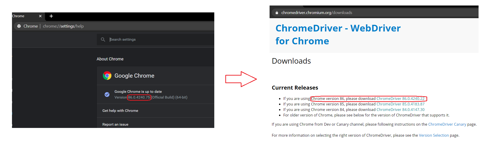
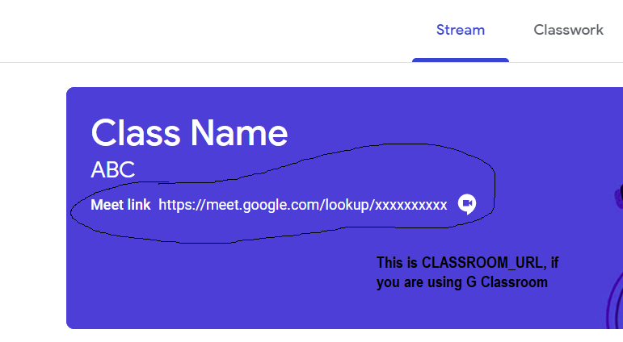

# gclass-bot

A python BOT written out of sheer necessity of not being able to get up on time on those lazy mornings to attend classes.

# Features!

  - Import your time-table and watch it attend all your classes everyday till eternity passes away.
  - Leave classes when number of people drops below a threshold.
  - Ability to sleep & wake-up according to schedule.
  - Auto log-in into your G-account


## You can also:

  - Deploy it on any cloud/VPS, the BOT can attend classes according to loaded timetable without any intervention.
  - One-click deploy to Heroku & Slack updates via PaperTrail add-on (coming soon!)

# Initial Set-Up

### This version only supports Chrome Browser, but it's pretty easy to modify the code to work with other browsers.

requires [Python v3](https://www.python.org/downloads/) to run.


## To set-up on your system, follow these steps:


1. Clone this repo.

```sh
$ git clone https://github.com/parshnt/gclass-bot.git
```
or

Simply download this repo as `.zip` file and extract the contents somewhere.


2. Check your chrome version by visiting `chrome://settings/help` and download appropriate version of ChromeDriver from [here](https://chromedriver.chromium.org/downloads). Place the chromedriver exectable inside this project's folder.




3. Navigate inside the folder and Install the requirements.

```sh
$ cd gclass-bot
$ pip install -r requirements.txt
```

4. Add your G-account Email-ID, password and link to join Google meet/ Google classroom link to [config.py](config.py).



5. Add your weekly timetable/schedule to [timetable.txt](timetable.txt). see [this](timetable.txt) for a detailed guide on how to load your schedule.

6. Run `python main.py` and rest will be taken care of :)

### Todo

 - Write Tests
 - Heroku One-click deploy app

## Contributing [](https://github.com/dwyl/esta/issues)

- Contributions and new features are welcome, as long as they don't break old ones.


## WARNING

- This was done only for the sake of experimentation and to see how far things can be automated. Attend your classes sincerely.
- YOU are choosing to use this, and if you point the finger at me if you got into any trouble, I will laugh at you.
- I'm not responsible for any consequence you might face if this bot failed or you get caught.

License
----

MIT
